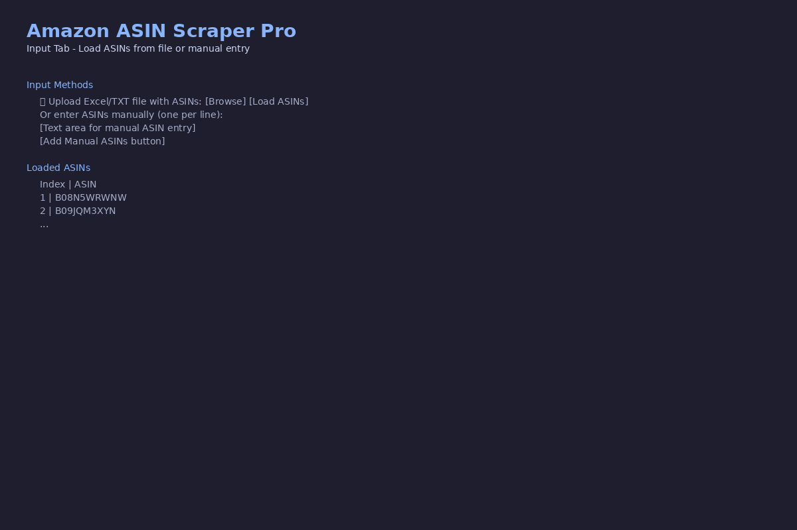
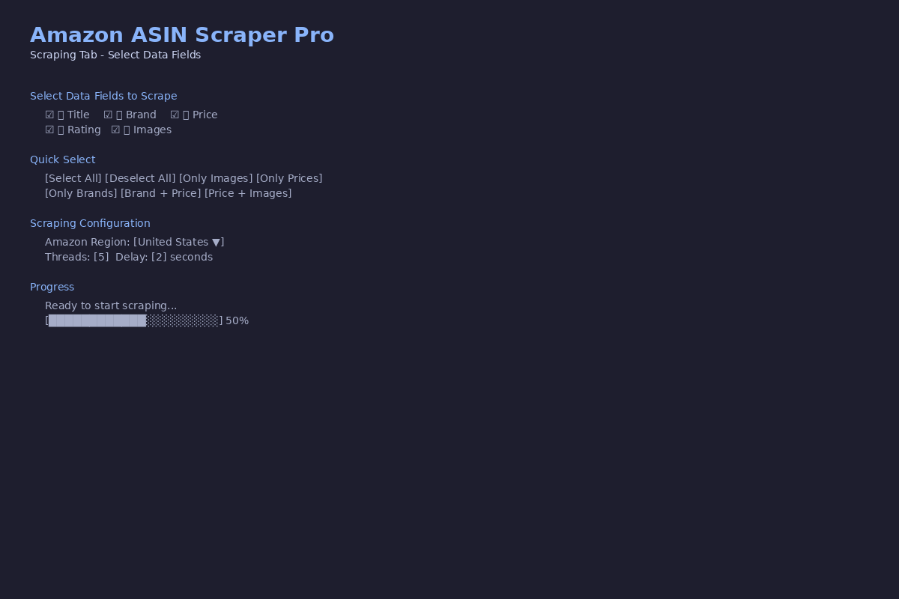
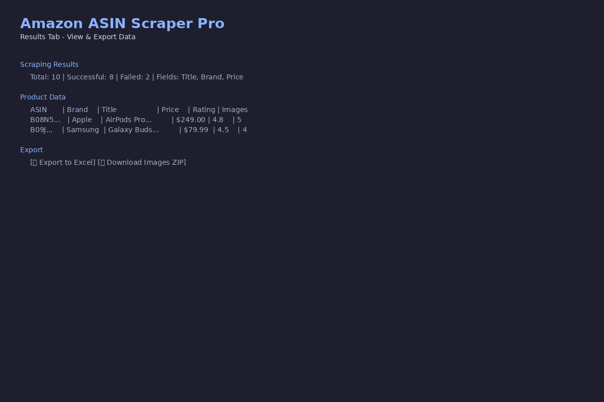
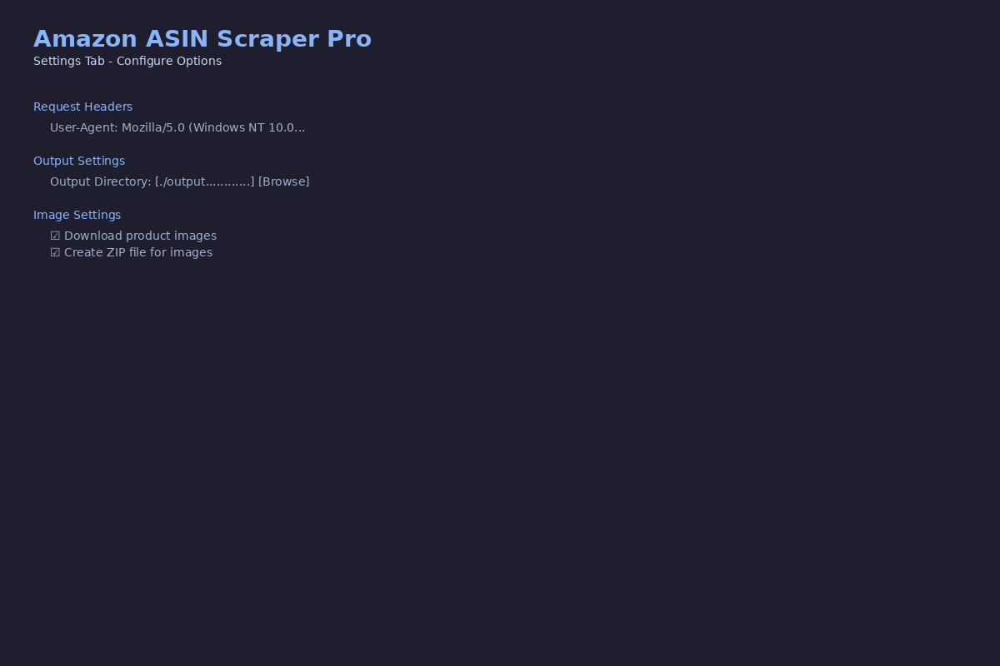

# Amazon Tools Dashboard

A collection of Selenium-based scraping tools for Amazon product data.

## Tools

### 1. Price Scraper (`backend/price.py`)
Scrapes product prices from Amazon.com
- Reads ASINs from `asins.txt`
- Sets US ZIP code for accurate pricing
- Outputs to `asin_prices1.xlsx`

### 2. Brand Scraper (`backend/brand.py`)
Scrapes brand names from Amazon.de
- Reads ASINs from `asins.txt`
- Outputs to `asin_brands.xlsx`

### 3. Photo Scraper (`backend/photo.py.py`)
Downloads product images from Amazon.co.uk
- Multi-threaded (4 workers)
- Saves images to `asin_images/` folder
- Tracks successful/failed ASINs in separate files

### 4. Amazon ASIN Scraper Pro (`amazon_asin_scraper_enhanced.py`)
A powerful desktop application for scraping Amazon product data using ASINs with a beautiful modern GUI.

#### Features
- **Multi-Region Support**: Scrape from 10 Amazon regions (US, UK, Germany, France, Italy, Spain, Canada, Japan, India, Australia)
- **Flexible Input**: Load ASINs from Excel (.xlsx, .xls) or TXT files, or enter manually
- **Multi-threading**: Configure 1-10 threads for parallel scraping
- **Real-time Progress**: Live progress tracking and logging
- **Selectable Data Fields**: Choose Title, Brand, Price, Rating, Images or any combination
- **Quick Select Buttons**: Select All, Only Images, Only Prices, Only Brands, Brand + Price, Price + Images
- **Export Options**: Export to Excel, download images (organized by brand), create ZIP archive

#### Installation
```bash
pip install pandas requests beautifulsoup4 pillow openpyxl lxml
```

#### Running the Application
```bash
python amazon_asin_scraper_enhanced.py
```

#### Screenshots

**Input Tab**


**Scraping Tab - Field Selection**


**Results Tab**


**Settings Tab**


## Setup

```bash
cd backend
pip install -r requirements.txt
```

## Usage

1. Create `asins.txt` with one ASIN per line
2. Run desired script:
   ```bash
   python backend/price.py    # Price scraper
   python backend/brand.py    # Brand scraper
   python backend/photo.py.py # Image downloader
   ```

## Requirements

- Python 3.8+
- Chrome browser
- See `backend/requirements.txt` for Python dependencies
